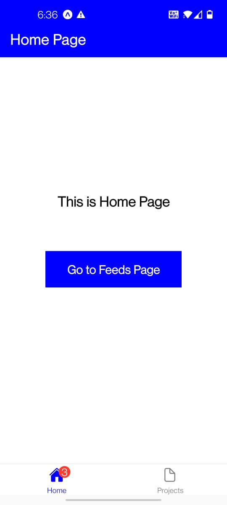
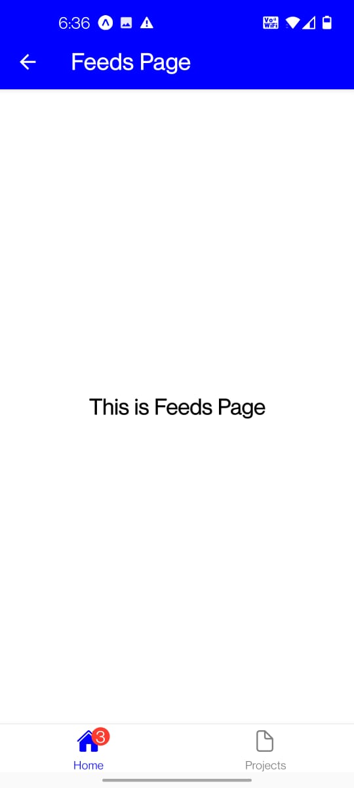
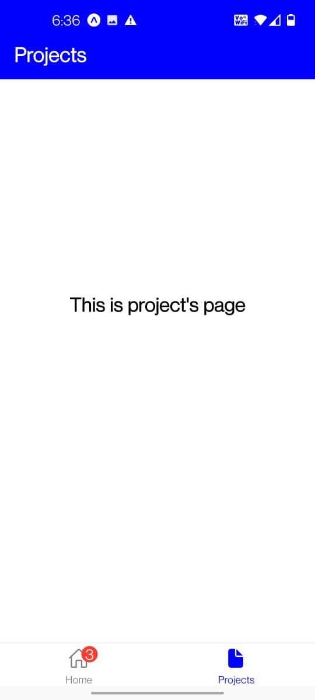

# Assessment6

App which shows functionality of react routers

Submitted by:

Name: Rochak Shrivastav

Reg. No.: 20BCE1814

This app will navigate you to different pages like projects page, home page and feeds page

On clicking 'Go to feeds page' the app will navigate you to feeds page from home page which is an example of stack navigator

On clicking 'Peojects' the app will navigate you to project page from home page

Some screenshots are:

- Home page:

  
- Feeds page:

  
- Project page:

  
